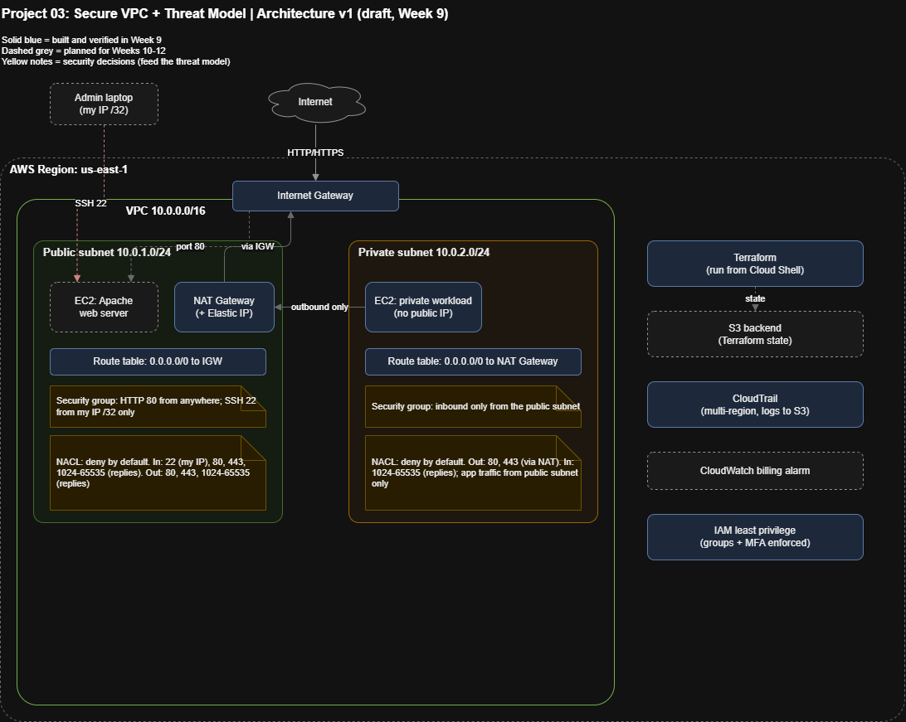

# Week 9 — VPC Architecture + Incident Response

## Overview

Built a full VPC from scratch using Terraform — public and private subnets, Internet Gateway, NAT Gateway, and correct routing for each. Followed this with three isolated incident drills, each built, broken, diagnosed with AWS VPC Reachability Analyzer, fixed, and re-verified.

## Core Build
- **VPC:** `10.0.0.0/16`
- **Public subnet:** `10.0.1.0/24` — route table points `0.0.0.0/0` to the Internet Gateway
- **Private subnet:** `10.0.2.0/24` — route table points `0.0.0.0/0` to a NAT Gateway (deployed inside the public subnet)
- Verified by launching test instances in each subnet and confirming public IP assignment matched expectations (public = yes, private = no)
- Full stack destroyed after verification to avoid ongoing NAT Gateway billing

## Incident 1 — Stateless NACL Blocking Return Traffic
**Setup:** Custom Network ACL on the public subnet allowed outbound HTTPS (443) but had no inbound rule at all.

**Diagnosis:** Used Reachability Analyzer to trace a reply path (Internet Gateway → instance, port 50000, representing a random ephemeral reply port). Result: **Not reachable**, with the NACL explicitly named as the blocker (`SUBNET_ACL_RESTRICTION`).

**Fix:** Added an inbound rule allowing ports 1024–65535 (the ephemeral range).

**Result:** Re-ran the same path — NACL component now succeeded.

**Takeaway:** NACLs are stateless — each direction needs its own explicit rule. Security Groups are stateful and don't have this failure mode, which is why this type of bug is NACL-specific.

## Incident 2 — One-Sided VPC Peering Route
**Setup:** Two VPCs (`10.0.0.0/16` and `10.1.0.0/16`) peered via `aws_vpc_peering_connection`. Deliberately added the return route to only one VPC's route table, leaving the other with no route back.

**Diagnosis:** Tested a TCP path between the two instances. Because TCP requires a return path to complete a connection, even the "working" direction reported **Not reachable** — the analyzer traced the break to the specific route table missing the entry (`NO_ROUTE_TO_DESTINATION`), despite every other hop (security groups, NACLs, the peering connection itself) succeeding.

**Fix:** Added the missing `aws_route` block pointing the second VPC's traffic back through the peering connection.

**Result:** Re-ran the same path — Reachable, with the route table showing the correct entry.

**Takeaway:** Peering requires independent route table entries on both sides. A connection that shows "active" tells you nothing about whether routing is actually complete — one missing entry breaks the whole connection, not just the reverse direction.

## Incident 3 — Database Instance in the Wrong Subnet
**Setup:** An instance meant to be a private database was deployed with `subnet_id` pointed at the public subnet, paired with an intentionally open security group (port 3306 from `0.0.0.0/0`).

**Diagnosis:** Reachability Analyzer (Internet Gateway → instance, port 3306) returned **Reachable** — every layer (NACL, security group, route) succeeded, with no blocker anywhere. Source address range in the trace represented the entire open internet.

**Fix:** Changed `subnet_id` to the private subnet. `terraform plan` showed a destroy-and-recreate (`-/+`), not an in-place update — subnet placement isn't mutable on a running instance.

**Result:** Re-ran the same path — Not reachable, with explanation `UNASSOCIATED_COMPONENT`: the Internet Gateway has no route to the private subnet at all. The still-open security group rule was never evaluated, because the trace fails before reaching that component.

**Takeaway:** Correct network placement alone neutralized the exposure, before the security group was ever fixed. Subnet placement is the first line of defense — a wide-open security group rule is a real problem to fix separately, but it can't be exploited from the internet if there's no route to the instance in the first place.

## Tools Used
- Terraform (VPC, subnets, route tables, IGW, NAT Gateway, peering, security groups, NACLs)
- AWS VPC Reachability Analyzer — configuration-based path tracing, not live traffic
- All infrastructure destroyed after each demo to avoid ongoing cost
